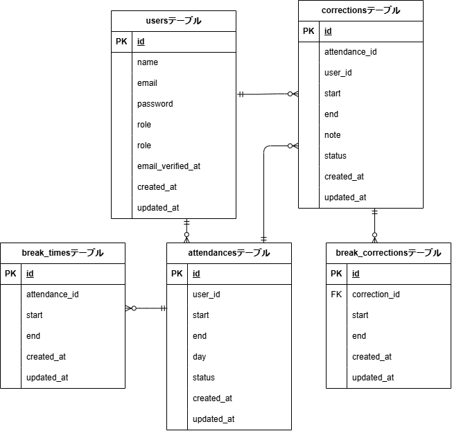

## アプリケーション名

coachtech フリマアプリ

## 環境構築

```
Dockerビルド

  1. git clone git@github.com:manami-neko/manami-furima.git
  2. コンテナ作成
     docker-compose up -d --build

＊MySQLはOSによって起動しない場合があるので、それぞれのPCに合わせてdocker-compose.ymlファイルを編集してください。

Laravel環境構築

  1.docker-compose exec php bash
  2.composer install
  3.env.exampleファイルから.evnを作成し、環境変数を変更
     cp .env.example .env
  4.php artisan key:generate
  5.php artisan migrate
  6.php artisan db:seed
    "The stream or file could not be opened"エラーが発生した場合
    srcディレクトリにあるstorageディレクトリ以下の権限を変更
    chmod -R 777 storage

テスト環境構築

  1.docker-compose exec mysql bash
  2.docker-compose.ymlファイルのMYSQL_ROOT_PASSWORD:に設定されているrootを入力する。
    mysql -u root -p
  3.CREATE DATABASE demo_test;
  4..env.exampleファイルから.env.testingを作成し、環境変数を変更
    cp .env .env.testing
      APP_ENV=local⇒APP_ENV=test
      APP_KEY=base64:vPtYQu63T1fmcyeBgEPd0fJ+jvmnzjYMaUf7d5iuB+c=⇒APP_KEY=
      DB_DATABASE=laravel_db⇒DB_DATABASE=demo_test
      DB_USERNAME=laravel_user⇒DB_USERNAME=root
      DB_PASSWORD=laravel_pass⇒DB_PASSWORD=root
  5.php artisan key:generate --env=testing
  6.キャッシュの削除をしないと反映されない場合があるので下記コマンドも実行
    php artisan config:clear
  7.php artisan migrate --env=testing
  8.php artisan db:seed --env=testing
  9.テスト実行
    全てのファイル
    php artisan test
    ファイル単体
    php artisan test tests/Feature/XxxxTest.php

ユーザーアカウント


一部変更
当日には修正できず、次の日以降に修正できる仕様にコーチと決めました

```

## 使用技術

```
    ・php 8.4.1
    ・Laravel 10.48.29
    ・MySQL 8.0.26
```

## URL

```
    ・環境開発：http://localhost/
    ・phpMyAdmin：http://localhost:8080/
```

## ER 図


